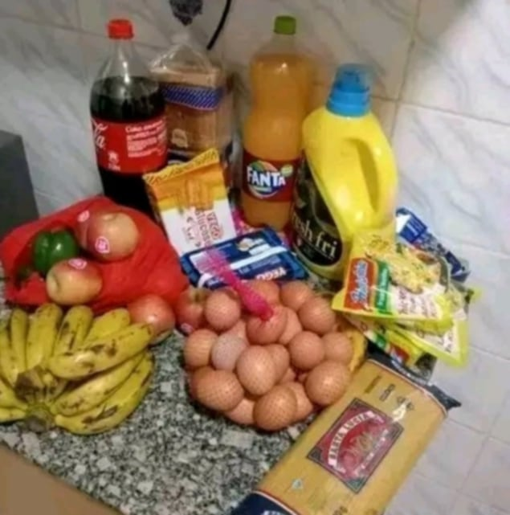
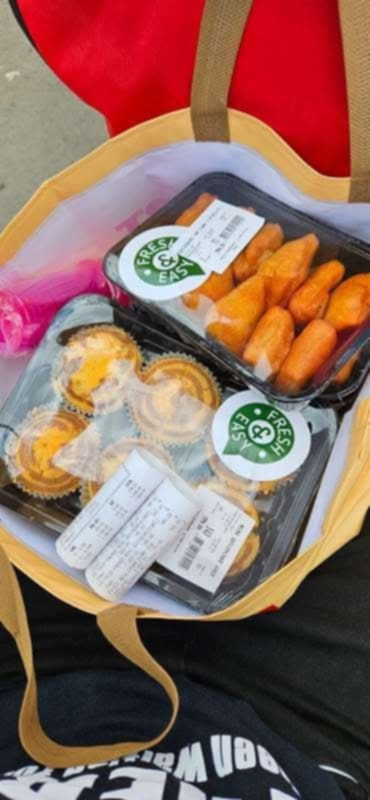

# Epistemological Experiments

## Gameified Altruism

Dear please assist me $10 will really help me alot

Have just been drinking water only am really starving honestly

Okay let me give you mpesa number for my neighbor he will give me
+254791291513 Samuel Maundu  
Nairobi, Kenya  

Martin Omuganda  
Eunice Musau  
Jakob Mukisa  
Dennis Mulusa  
Red Angel  
Mike Wilonja  

---

Life in Kawangware: Struggling to Survive

[Kwangware](https://en.m.wikipedia.org/wiki/Kawangware), a densely populated settlement in Nairobi, Kenya, is home to over 130,000 people, most living in severe poverty. The majority survive on less than $2 a day, working informal jobs like street vending, manual labor, or domestic work. Unemployment is high, and for many families, food is not guaranteed each day.

Basic services are unreliable. Clean water is scarce, and most residents must buy it at high prices or rely on unsafe sources, increasing the risk of cholera, typhoid, and other waterborne diseases. The poor sanitation and drainage systems contribute to the spread of respiratory illnesses, malaria, and other preventable diseases.

Education is also a challenge. While schools exist, many children do not attend due to lack of fees, school supplies, or the need to work and support their families. Others drop out because they cannot afford meals, uniforms, or transport.

Among Kawangware’s residents are refugee families from Burundi, DR Congo, and Rwanda, who often face additional struggles such as discrimination, lack of legal documentation, and difficulty finding work. Many live in makeshift housing with no guarantee of stability or security.

For the people of Kawangware, daily life is about survival. The need for clean water, food security, healthcare, and education remains urgent. Without intervention, thousands will continue to live in unsafe and inhumane conditions with little hope for improvement.

Support is needed. Immediate action can help provide access to basic necessities and create sustainable solutions for those living in extreme poverty.

---

19$ Buys:

---

 
